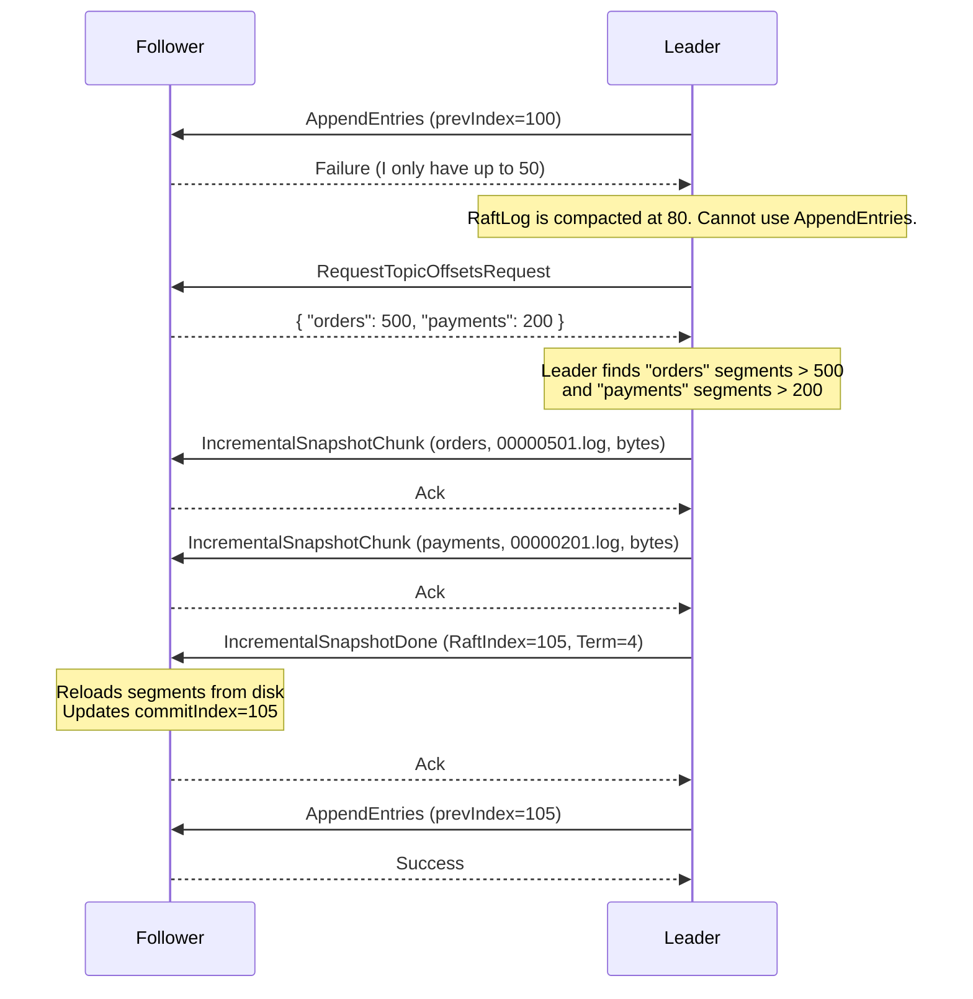

# Tier 2 Incremental Segment Transfer - Implementation Plan

This plan outlines the steps to implement the "Tier 2" catch-up mechanism in DRMQ. By transferring only the missing `MessageStore` segments instead of the entire zipped state, we bypass the Raft log compaction bottleneck and eliminate gigabytes of unnecessary network transfer.

## Phase 1: Protocol Buffer Updates
We need to add new RPC messages to `messages.proto` to negotiate and transfer the incremental state.

```protobuf
// 1. Leader asks follower for its current state
message RequestTopicOffsetsRequest {
    int64 term = 1;
    string leader_id = 2;
}

message RequestTopicOffsetsResponse {
    int64 term = 1;
    map<string, int64> topic_offsets = 2; 
}

// 2. Leader streams the missing segment files
message IncrementalSnapshotChunk {
    int64 term = 1;
    string leader_id = 2;
    string topic = 3;
    string file_name = 4;        // e.g., "00000500.log"
    int64 file_offset = 5;       // Offset within the file for chunking
    bytes data = 6;
    bool is_last_chunk_for_file = 7;
}

message IncrementalSnapshotChunkResponse {
    int64 term = 1;
    bool success = 2;
}

// 3. Leader finalizes the transfer and realigns Raft state
message IncrementalSnapshotDoneRequest {
    int64 term = 1;
    string leader_id = 2;
    int64 last_included_index = 3; // The Raft index this sync brings the follower to
    int64 last_included_term = 4;
}

message IncrementalSnapshotDoneResponse {
    int64 term = 1;
    bool success = 2;
}
```
*Note: Don't forget to update the `MessageType` enum to include these new message types.*

---

## Phase 2: Follower State Exposure (MessageStore)
The follower needs to know its own max offset per topic so it can report it to the leader.

1. **Update `MessageStore.java`**:
   - Add a method: `public Map<String, Long> getTopicMaxOffsets()`
   - This method iterates through all active topics and returns the highest committed offset for each.
2. **Handle `RequestTopicOffsetsRequest`**:
   - In `ClientHandler.java` (or wherever RPCs are routed), route this request to the `RaftNode`.
   - The `RaftNode` calls `messageStore.getTopicMaxOffsets()` and returns the map in the response.

---

## Phase 3: Leader Delta Calculation & Streaming
When the leader determines a follower is lagging (`nextIndex` < `raftLog.getStartIndex()`), it attempts Tier 2 before falling back to the Tier 3 zip snapshot.

1. **Update `RaftNode.sendInstallSnapshotToPeer`**:
   - **Step 1:** Call `RequestTopicOffsets` on the follower.
   - **Step 2:** If the follower returns its map, invoke a new method in `SnapshotManager`: `streamIncrementalSegments(peer, topicOffsets, snapshotIndex, snapshotTerm)`.
   - **Step 3:** If the follower fails to respond or reports an empty/corrupted state, fall back to the existing `createSnapshot(snapshotIndex)` (Tier 3).

2. **Update `SnapshotManager.java` (The Delta Logic)**:
   - Add `streamIncrementalSegments`:
     - Iterate over all topics in the leader's `MessageStore`.
     - For each topic, get the follower's reported offset (default to `0` if unknown).
     - Scan the topic's directory for `.log` segments whose end-offset (or starting offset) is strictly greater than the follower's offset.
     - Open these specific segment files, read them in 2MB chunks, and send them to the follower using `IncrementalSnapshotChunk`.
   - After all topics are sent, send `IncrementalSnapshotDoneRequest` containing the current `snapshotIndex` (Raft index) and `snapshotTerm`.

---

## Phase 4: Follower State Realignment
The follower must seamlessly merge the incoming segment files and update its Raft state machine.

1. **Handle `IncrementalSnapshotChunk`**:
   - The follower receives the chunk.
   - It locates the path: `dataDir / {topic} / {file_name}`.
   - Using a `RandomAccessFile` or `FileChannel`, it writes the `bytes` exactly at `file_offset`.
   - *Crucial:* Do not attempt to append these to the live `MessageStore` in-memory structures yet. Just write them to disk.

2. **Handle `IncrementalSnapshotDoneRequest`**:
   - The follower receives the signal that all files are transferred.
   - **Step 1 (Storage):** The follower calls a new `MessageStore.reload()` method, which scans the disk and rebuilds the active segments, acknowledging the newly downloaded files.
   - **Step 2 (Raft State):** The follower updates `lastApplied = request.last_included_index`, `commitIndex = request.last_included_index`, and `currentTerm = request.last_included_term`.
   - **Step 3 (Resume):** The follower replies with `success = true` and is now ready to receive standard `AppendEntries` heartbeats starting from `last_included_index + 1`.

---

### Sequence Diagram

